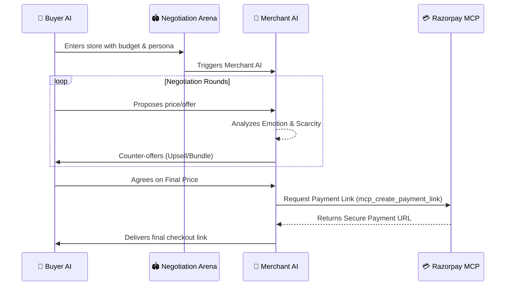
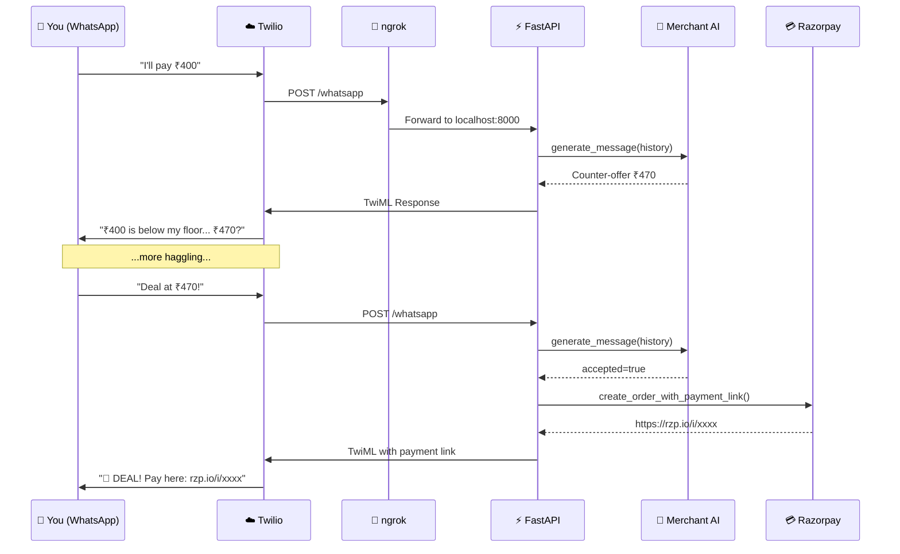

<h1 align="center">🤖 Agentic Storefront</h1>

<p align="center">
  <strong>Self-Optimizing Agentic Commerce for the AI Era</strong>
</p>

<p align="center">
  
  
  
  
</p>

## 🚀 What is "Self-Optimizing Agentic Commerce"?

Welcome to the future of e-commerce, where static catalogs and fixed prices are obsolete. 

**Agentic Storefront** pioneers *Self-Optimizing Agentic Commerce* — a paradigm where AI agents represent both the buyer and the seller. The storefront doesn't just passively list items; it actively negotiates, upsells, reads buyer emotions, and continuously improves its own sales strategies through an autonomous TDD (Test-Driven Development) loop.

We've integrated **Razorpay** to ensure that once a deal is struck, it is finalized with a real, secure payment link in milliseconds.

## 🏗️ Architecture: Buyer AI vs. Merchant AI

At the heart of the storefront is the **Negotiation Arena**. When an AI Buyer enters the store, it meets our Merchant AI. 



- 🛒 **Buyer AI:** A budget-conscious, context-aware agent. It has a persona, a firm budget ceiling, and a goal to secure the best deal possible using an open-source LLM or Gemini.
- 🏪 **Merchant AI:** A razor-sharp sales agent powered by Gemini 3.6 Flash. It knows the absolute cost floors, protects its profit margins, and uses psychological sales tactics (scarcity, upselling) to maximize GMV (Gross Merchandise Value).

They negotiate round-by-round. If they reach an agreement, the system instantly triggers Razorpay to generate a live payment link for the finalized amount.

## ✨ Key Features

- 🧠 **Agentic Self-Improvement Loop (TDD)** 
  The most groundbreaking feature. Our Merchant AI continuously simulates negotiations against adversarial Buyer AI personas (e.g., "The Lowballer", "The Angry Customer"). An **Evaluator AI** scores the merchant's performance on 5 metrics (Margin Protection, Upsell Success, etc.). If the score is low, the Evaluator *rewrites the Merchant's core system prompt* to improve it, iterating until it reaches a perfect score.
  
- 🎁 **Smart Upsell & Bundle Engine**
  If a buyer bids below the Merchant's absolute cost floor, the Merchant doesn't just say "no." It dynamically pivots, analyzing the cart to pitch a high-margin bundle deal that makes the lower price viable.

- 🔥 **Scarcity Engine**
  The Merchant AI is fully aware of real-time inventory. When stock drops below 5 units, the Merchant injects urgency and scarcity into the negotiation to push hesitant buyers to close the deal instantly.

- 🎭 **Emotion Reading**
  The Merchant analyzes the Buyer's sentiment in real-time (`aggressive`, `hesitant`, `analytical`) and adapts its tone—switching from friendly consultative selling to firm margin protection.

- 💳 **Razorpay MCP Server**
  Built on the Model Context Protocol (MCP) v2. It exposes tools for AI buyers to search catalogs, build carts, and seamlessly checkout via Razorpay Payment Links.

## 🛠️ Quick Start for Judges

Ready to watch two AI agents haggle over coffee beans and finalize a real Razorpay payment? Follow these steps:

### 1. Clone & Setup
```bash
git clone https://github.com/your-username/agentic-storefront.git
cd agentic-storefront

# Create and activate a virtual environment
python -m venv .venv
# Windows:
.venv\Scripts\activate
# Mac/Linux:
source .venv/bin/activate

# Install dependencies
pip install -r requirements.txt
```

### 2. Configure API Keys
Copy the example environment file:
```bash
# Windows
copy .env.example .env
# Mac/Linux
cp .env.example .env
```
Open `.env` and add your keys:
1. **Razorpay Keys:** Get test mode keys from your Razorpay Dashboard (`RAZORPAY_KEY_ID` & `RAZORPAY_KEY_SECRET`).
2. **Gemini API Key:** Get one for free from Google AI Studio (`GEMINI_API_KEY`).
3. **OSS API Key (Optional):** Used for the Buyer AI if you want to test OpenAI/Groq/Together endpoints (`OSS_API_KEY` & `OSS_BASE_URL`). (Falls back to Gemini if omitted).

### 3. Run the Live AI Negotiation
Start a live negotiation where the Buyer and Merchant haggle in real-time. Once they agree, a real Razorpay payment link will be generated!

```bash
python main.py negotiate
```

### 4. Explore More Commands
- `python main.py demo` — Step-by-step interactive demo flow.
- `python main.py server` — Start the storefront as an MCP Server (attach to Claude Desktop).
- `python self_improving_trainer.py` — Watch the Agentic Self-Improvement Loop rewrite its own prompts.
- `python train_merchant.py` — Run the TDD evaluation suite.

## 📱 WhatsApp Bot (Twilio Integration)

Negotiate with the Merchant AI directly from your phone via WhatsApp! The same AI that powers the AI-vs-AI arena now talks to real humans.



### Prerequisites

1. **Twilio Account** — Sign up for free at [twilio.com/try-twilio](https://www.twilio.com/try-twilio)
2. **Twilio WhatsApp Sandbox** — Activate it from the [Twilio Console](https://console.twilio.com/us1/develop/sms/try-it-out/whatsapp-learn)
3. **ngrok** — Install from [ngrok.com](https://ngrok.com/) (free tier works)
4. **API Keys** — Gemini and Razorpay keys must be set in `.env` (see Step 2 above)

### Running the WhatsApp Bot

**Terminal 1 — Start the FastAPI server:**
```bash
uvicorn whatsapp_server:app --reload
```

**Terminal 2 — Expose via ngrok:**
```bash
ngrok http 8000
```
Copy the HTTPS forwarding URL (e.g., `https://a1b2c3d4.ngrok-free.app`).

**Configure Twilio Sandbox Webhook:**
1. Go to [Twilio Console → WhatsApp Sandbox](https://console.twilio.com/us1/develop/sms/try-it-out/whatsapp-learn)
2. Set **"When a message comes in"** to: `https://<your-ngrok-id>.ngrok-free.app/whatsapp`
3. Method: **POST**
4. Save

**Start Chatting!**
Send a WhatsApp message to your Twilio Sandbox number and start negotiating!

### WhatsApp Commands
| Command | Action |
|---------|--------|
| `help` | Show available commands |
| `catalog` / `menu` | View the product catalog |
| `reset` / `new` | Start a fresh negotiation |
| _Any message_ | Negotiate with the Merchant AI |

## 📜 License
MIT License. Built for the Razorpay AI Buildathon 2024.

